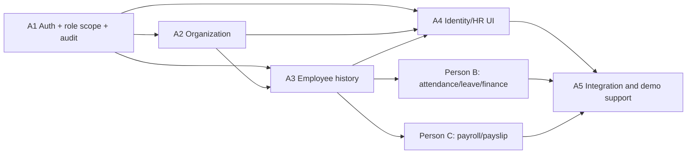
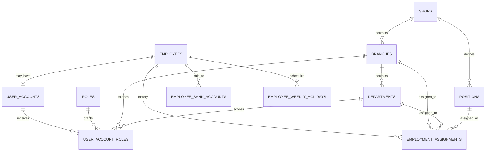
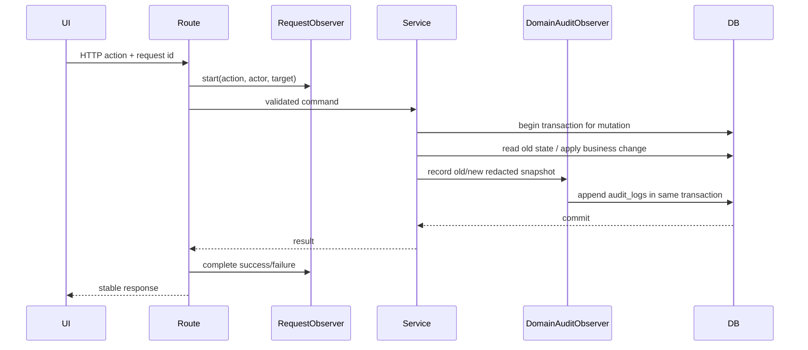

# Person A Detailed Work Plan

เอกสารนี้แตกงานของ Person A จาก `docs/two-week-three-person-plan.md` สำหรับ
demo sprint 10 วันทำงาน โดยเป็นแผนงานเท่านั้น ยังไม่อนุญาตให้เริ่ม implementation
จากเอกสารนี้โดยอัตโนมัติ

> เอกสารนี้เป็นแผนก่อนเริ่มงาน รวมถึง planning gates ท้ายเอกสารที่คงสถานะเดิมไว้
> หลักฐานการดำเนินงานจริงและข้อจำกัดล่าสุดอยู่ใน specs ของ A1–A5

## 1. เป้าหมายและขอบเขตที่ยืนยันแล้ว

Person A รับผิดชอบ Identity, organization และ employee master/history ตั้งแต่
backend foundation ที่เกี่ยวข้องไปจนถึงหน้าจอ HR โดยต้องทำให้ flow ต่อไปนี้พร้อม
ส่งต่อให้ Person B และ Person C:

```text
เข้าสู่ระบบ
→ ระบุตัวผู้ใช้งานและสิทธิ์จริง
→ ตั้งค่าโครงสร้างองค์กร
→ สร้างพนักงานและบัญชีผู้ใช้
→ กำหนดสาขา/แผนก/ตำแหน่ง/ค่าจ้าง/วันหยุด/บัญชีธนาคาร
→ เปลี่ยนสังกัดหรือค่าจ้างโดยรักษาประวัติ
→ ส่งข้อมูลที่ผ่าน authorization ให้ attendance และ payroll
```

การตัดสินใจที่ยืนยันแล้ว:

- ใช้ signed JWT ใน `HttpOnly` cookie อายุ 8 ชั่วโมง, `SameSite=Lax`, เปิด
  `Secure` ใน production และ logout โดยลบ cookie ไม่มี refresh tokenใน sprint นี้
- A1 รวม create account, employee linking, temporary password, password reset,
  unlock, enable/disable และ assign/revoke role
- Owner อ่านและจัดการข้อมูลได้ทุกสาขา ไม่ใช่ read-only
- Employee attachment ถูกเลื่อนไป package attachment ภายหลัง หน้าจอ Person A
  แสดงสถานะ deferred ได้ แต่ห้ามสร้าง upload/storage flow ใน sprint นี้
- Role master มี 5 role คงที่: `EMPLOYEE`, `SUPERVISOR`, `BRANCH_MANAGER`,
  `HR`, `OWNER`; ไม่มี role CRUD ใน sprint นี้
- ทุก backend action ต้องผ่าน audit observer ทั้ง read, write, success และ failure
  โดย action ที่แก้ข้อมูลต้องมี domain audit ซึ่ง commit พร้อมข้อมูลธุรกิจใน
  transaction เดียวกัน

## 2. แหล่งอ้างอิงและหน้าจอที่ Person A ต้องรองรับ

| แหล่ง | ส่วนที่ใช้ |
|---|---|
| `haris-payroll-postgresql.dbml` | ตาราง organization, identity, account, role, assignment, bank และ weekly holiday |
| `haris-payroll-orm-reference.md` | relation, delete behavior, scope validation และ effective-date rules |
| `2026-09-10-haris-payroll-dbml-design.md` | เหตุผลของ model และ constraint ที่ DBML บังคับไม่ได้ |
| `output/pdf/haris-payroll-wireframes.pdf` | หน้า 2, 13, 19, 28-34, 50 และ shared states หน้า 58-60 |
| `docs/project-working-roadmap.md` | Gate 2 และ Gate 3 |
| `docs/haris-payroll-product-backlog.md` | T002, T004-T005 และ T009-T025 ที่อยู่ในขอบเขต Person A |

### Screen-to-package mapping

| หน้า wireframe | หน้าจอ | Package | หมายเหตุ |
|---:|---|---|---|
| 2 | เข้าสู่ระบบ | A1/A4 | รองรับผิดพลาด, lock 15 นาที, disabled และ forbidden |
| 13 | ข้อมูลส่วนตัว | A3/A4 | พนักงานอ่านข้อมูลตัวเอง; เลขบัญชีต้อง mask |
| 19 | พนักงานในสาขา | A3/A4 | Branch manager เห็นข้อมูลพื้นฐานเฉพาะสาขา |
| 28 | ทะเบียนพนักงาน | A3/A4 | ค้นหา/กรอง/แบ่งหน้า/แสดง inactive และ terminated |
| 29-30 | เพิ่มพนักงานสองขั้น | A3/A4 | สร้าง employee, assignment, bank, holiday และ account แบบ orchestration |
| 31 | ข้อมูลและประวัติการจ้าง | A3/A4 | ห้ามแก้ทับ assignment เดิม |
| 32 | ธนาคาร วันหยุด เอกสาร | A3/A4 | เอกสารเป็น deferred; bank แสดง last 4 เท่านั้น |
| 33-34 | บัญชีผู้ใช้และสิทธิ์ | A1/A4 | Owner และ HR จัดการได้ทุกสาขา |
| 50 | โครงสร้างองค์กร | A2/A4 | ร้าน สาขา แผนก ตำแหน่ง; deactivate แทน delete |
| 58-59 | Mobile/shared states | A4 | loading, empty, validation, error, forbidden, success |
| 60 | คำถามธุรกิจ | A5 | ไม่ให้คำถาม payroll ขยาย scope ของ Person A |

## 3. ขอบเขตข้อมูลและ dependency diagram





## 4. Authorization matrix

การอนุญาตทุกกรณีอยู่ใน service และตรวจจาก role grants ปัจจุบันในฐานข้อมูล
JWT เก็บเพียง account identity และเวลาหมดอายุ ไม่ snapshot roles ลง token เพื่อให้
การถอนสิทธิ์มีผลกับ request ถัดไป

| Action | Employee | Supervisor | Branch manager | HR | Owner |
|---|---:|---:|---:|---:|---:|
| ดู `/me` และ profile ตนเอง | own | own | own | own | own/account |
| ดูรายชื่อพนักงาน | own | department | branch | all | all |
| ดูข้อมูลพื้นฐานพนักงาน | own | department | branch | all | all |
| ดู compensation history | no | no | no | all | all |
| ดูบัญชีธนาคารแบบ masked | own | no | no | all | all |
| สร้าง/แก้/เปลี่ยนสถานะพนักงาน | no | no | no | all | all |
| เพิ่ม assignment/transfer/promotion/pay change | no | no | no | all | all |
| จัดการ bank/weekly holiday | no | no | no | all | all |
| ดู organization master | scoped | scoped | scoped | all | all |
| สร้าง/แก้/deactivate organization | no | no | no | all | all |
| จัดการ account และ role grants | no | no | no | all | all |
| อ่าน audit ของ Person A domains | no | no | no | all | all |

กฎ scope ของ `user_account_roles`:

```text
self       → branch_id=NULL, department_id=NULL
department → branch_id required, department_id required และ department อยู่ใน branch
branch     → branch_id required, department_id=NULL
all        → branch_id=NULL, department_id=NULL
```

ข้อห้ามเพิ่มเติม:

- ห้าม account มอบสิทธิ์ที่กว้างกว่าสิทธิ์ของตนเอง
- HR และ Owner เป็น `all`; ทั้งคู่จัดการข้อมูลได้ทุกสาขาตามการตัดสินใจล่าสุด
- role ที่ `is_active=false` ใช้สร้าง grant ใหม่ไม่ได้
- account disabled ใช้ login ไม่ได้ แม้ JWT เดิมยังไม่หมดอายุ เพราะ middleware
  ต้องโหลดสถานะ account ใหม่ทุก request
- Supervisor/Branch manager เห็นเฉพาะข้อมูลพื้นฐานที่จำเป็นต่อการจัดทีม
  และไม่เห็น salary, welfare, national/passport ID เต็ม หรือ bank details

## 5. Cross-cutting design

### 5.1 Backend layer contract

ทุก feature ใช้ flow:

```text
Elysia route → controller → service → repository → Drizzle/PostgreSQL
                    └────→ mapper → response DTO
```

- Route: path, method, auth hook, validation และ controller binding เท่านั้น
- Controller: แปลง validated input เป็น command และ map response
- Service: authorization, business rules, transactions และ audit action
- Repository: query/persistence เท่านั้น
- Mapper: pure conversion และ redaction/masking ของ response DTO
- ห้าม route/controller import Drizzle schema โดยตรง
- ห้าม service คืน HTTP response หรือ response DTO

### 5.2 Authentication policy

- Password hash ใช้ `Bun.password.hash/verify` ด้วย Argon2id และไม่ log input/hash
- JWT cookie ชื่อคงที่ เช่น `haris_session`; payload ขั้นต่ำ `sub`, `iat`, `exp`
- Cookie: `HttpOnly`, `SameSite=Lax`, `Path=/`, `Secure` เมื่อ production
- ทุก mutation ที่ auth ด้วย cookie ตรวจ `Origin`/allowed origin เพื่อป้องกัน CSRF
- Login failure ครั้งที่ 1-4 เพิ่ม counter; ครั้งที่ 5 lock 15 นาที
- ระหว่าง lock ตอบ stable code `ACCOUNT_LOCKED` พร้อมเวลา retry โดยไม่เปิดเผยข้อมูลเกินจำเป็น
- Login สำเร็จ reset failed attempts/lock, อัปเดต `last_login_at` และออก cookie
- Logout ลบ cookie; ข้อจำกัดคือ token ที่ถูกคัดลอกยังใช้ได้จนหมดอายุสูงสุด 8 ชั่วโมง
- `/me` โหลด account status และ grants ใหม่จากฐานข้อมูลทุกครั้ง
- Temporary password ต้องถูกสุ่มและแสดงเพียงครั้งเดียว; เอกสาร handoff ห้ามบันทึกค่าจริง
- Sprint นี้ไม่มี forgot-password email, refresh token, multi-device session list หรือ MFA

### 5.3 Audit observer: ครอบทุก action

ใช้สองระดับร่วมกัน ไม่พึ่ง database trigger เพียงอย่างเดียว:



1. `ActionObserver` ครอบ public service use case ทุกตัว
   - บันทึก read/list/create/update/deactivate/login/logout/role-grant และ failure
   - ใส่ `request_id`, actor, action code, target และ outcome
   - failure ที่ transaction rollback ต้องเขียน audit แยกหลัง rollback เพื่อไม่ให้หาย
2. `DomainAuditObserver` สำหรับ mutation
   - บันทึก `old_data`/`new_data` ใน transaction เดียวกับ business change
   - ถ้าเขียน audit ไม่สำเร็จ mutation ต้อง rollback
3. Request ID
   - รับ header ที่รูปแบบถูกต้องหรือสร้างใหม่
   - ส่งกลับใน response/error และเชื่อม request กับ domain audit
4. Redaction allowlist
   - ห้ามเก็บ password, temporary password, password hash, JWT, cookie,
     authorization header, national/passport ID เต็ม และเลขบัญชีเต็ม/ciphertext
   - bank audit เก็บ bank code/name, last4, primary/active flags เท่านั้น
   - authentication failure ไม่บันทึกรหัสผ่านและไม่ echo credential
5. Append-only
   - ไม่มี update/delete repository method สำหรับ audit log
   - endpoint audit เป็น read-only และ scoped เฉพาะ HR/Owner

Action naming ใช้รูปแบบ `<domain>.<resource>.<verb>.<outcome>` เช่น:

```text
auth.login.succeeded
auth.login.failed
auth.logout.succeeded
account.role.granted
organization.branch.deactivated
employee.profile.viewed
employee.assignment.created
employee.bank.primary_changed
```

คำว่า “ทุก action” ในแผนนี้หมายถึงทุก backend use case/endpoint invocation
รวม read และ failure ไม่ใช่การจับทุก click ที่ไม่ส่ง request เช่น เปิด/ปิด accordion
ใน browser

### 5.4 Stable API envelope and errors

ให้ Person C เป็นเจ้าของ shared response contract; Person A ส่ง requirement ต่อไปนี้:

```text
success: { data, meta?, request_id }
error:   { error: { code, message, field_errors? }, request_id }
```

Error codes ขั้นต่ำ:

```text
AUTH_REQUIRED
INVALID_CREDENTIALS
ACCOUNT_LOCKED
ACCOUNT_DISABLED
FORBIDDEN_SCOPE
INVALID_ROLE_SCOPE
DUPLICATE_CODE
DUPLICATE_IDENTITY
DUPLICATE_USERNAME
RESOURCE_NOT_FOUND
RESOURCE_IN_USE
EFFECTIVE_DATE_OVERLAP
INVALID_ORGANIZATION_RELATION
PRIMARY_BANK_ACCOUNT_CONFLICT
EMPLOYEE_ACCOUNT_ALREADY_EXISTS
STATE_CONFLICT
VALIDATION_ERROR
```

## 6. API contract inventory

Path จริงต้อง freeze กับ Person C ก่อน implement shared client แต่ resource shape ใช้ตามนี้

### A1 Authentication/account/role

```text
POST   /api/v1/auth/login
POST   /api/v1/auth/logout
GET    /api/v1/auth/me

GET    /api/v1/accounts
POST   /api/v1/accounts
GET    /api/v1/accounts/:account_id
PATCH  /api/v1/accounts/:account_id/status
POST   /api/v1/accounts/:account_id/reset-password
POST   /api/v1/accounts/:account_id/unlock
POST   /api/v1/accounts/:account_id/roles
DELETE /api/v1/accounts/:account_id/roles/:grant_id

GET    /api/v1/roles
GET    /api/v1/audit-logs
```

`/auth/me` ส่ง safe account DTO, employee summary, grants และ effective navigation
capabilities; ไม่ส่ง password hash, failed-attempt internals หรือ bank data

### A2 Organization

```text
GET/POST     /api/v1/shops
GET/PATCH    /api/v1/shops/:shop_id
POST         /api/v1/shops/:shop_id/deactivate

GET/POST     /api/v1/branches
GET/PATCH    /api/v1/branches/:branch_id
POST         /api/v1/branches/:branch_id/deactivate

GET/POST     /api/v1/departments
GET/PATCH    /api/v1/departments/:department_id
POST         /api/v1/departments/:department_id/deactivate

GET/POST     /api/v1/positions
GET/PATCH    /api/v1/positions/:position_id
POST         /api/v1/positions/:position_id/deactivate
```

List รองรับ `page`, `page_size`, `search`, `is_active` และ parent filter ที่เกี่ยวข้อง
ไม่มี hard-delete route

### A3 Employee/history/bank/holiday

```text
GET/POST     /api/v1/employees
GET/PATCH    /api/v1/employees/:employee_id
PATCH        /api/v1/employees/:employee_id/status

GET          /api/v1/employees/:employee_id/assignments
POST         /api/v1/employees/:employee_id/assignments

GET/POST     /api/v1/employees/:employee_id/bank-accounts
PATCH        /api/v1/employees/:employee_id/bank-accounts/:bank_account_id
POST         /api/v1/employees/:employee_id/bank-accounts/:bank_account_id/make-primary
POST         /api/v1/employees/:employee_id/bank-accounts/:bank_account_id/deactivate

GET/POST     /api/v1/employees/:employee_id/weekly-holidays
POST         /api/v1/employees/:employee_id/weekly-holidays/:holiday_id/end
```

หน้าสร้างพนักงานสองขั้นใช้ orchestration endpoint หรือ client sequence ที่ตกลงก่อน
implement โดยค่าแนะนำคือ orchestration command เดียวใน employee service เพื่อให้
employee + first assignment + optional bank + holiday + optional account สำเร็จหรือ
rollback พร้อมกัน ห้าม controller เรียกหลาย repositories เอง

## 7. Work packages และ task breakdown

แต่ละ task ตั้งเป้า 1-4 ชั่วโมงและต้องมี verification ของตนเอง การสร้าง spec จริง
ใช้หนึ่ง feature spec ต่อ A1/A2/A3/A4/A5 ไม่สร้างหนึ่ง spec ต่อไฟล์

### A1 - Authentication foundation (Day 1-2)

**Outcome:** protected route ระบุตัว actor ได้, enforce scope, จัดการ account/role
ได้ และทุก action มี audit evidence

| ID | งาน | ไฟล์หลัก/เจ้าของ | ประมาณ | Depends on | Verification |
|---|---|---|---:|---|---|
| A1-01 | Freeze auth/API/error/audit contracts กับ Person C | spec/contracts only | 1.5h | Gate 1 | contract review checklist |
| A1-02 | Typed application errors และ public error mapping | `core/errors/` | 2h | A1-01 | focused error-boundary tests |
| A1-03 | Password policy, JWT cookie, CSRF/origin และ authenticated actor | `core/auth/` | 3h | A1-01 | hash/cookie/expiry/redaction tests |
| A1-04 | Request ID และ ActionObserver/DomainAuditObserver | `core/audit/`, `features/audit/` | 3h | A1-02 | success/failure/rollback audit tests |
| A1-05 | Account repository + login/logout/me service | `features/user-account/` | 3h | A1-03,A1-04 | 1-4 failure, 5th lock, expiry tests |
| A1-06 | Authorization evaluator self/department/branch/all | `core/auth/authorization.ts` | 2.5h | A1-03 | matrix-driven scope tests |
| A1-07 | Account admin + role grant/revoke + reset/unlock/status | `features/user-account/`, `features/role/` | 3h | A1-04,A1-06 | invalid combination/escalation tests |
| A1-08 | DTO/schema/mapper/controller/routes; export route plugin | feature files | 2h | A1-05,A1-07 | route integration test; no `app.ts` edit |

Critical acceptance cases:

- wrong credentials ไม่บอกว่า username มีจริงหรือไม่
- ครั้งที่ 5 lock 15 นาที; successful login หลัง lock หมดอายุ reset counter
- disabled account และ inactive role grant ใช้งานไม่ได้
- revoke role มีผล request ถัดไปเพราะ grants โหลดจาก DB
- Owner/HR จัดการ all scope ได้; ผู้ใช้อื่นยกระดับสิทธิ์ไม่ได้
- audit login failure ไม่มี password/token/hash และ audit mutation rollback พร้อมข้อมูล
- error DTO มี stable code และ request ID

### A2 - Organization (Day 3)

**Outcome:** Owner/HR จัดการ shop, branch, department, position ได้ครบ โดยรักษา
referential history และผู้ใช้ scoped อ่านเฉพาะที่อนุญาต

| ID | งาน | ไฟล์หลัก | ประมาณ | Depends on | Verification |
|---|---|---|---:|---|---|
| A2-01 | Define organization DTO/filter/commands | 4 feature folders | 1h | A1-01 | typecheck/contracts review |
| A2-02 | Shop/branch repositories + services | `shop/`, `branch/` | 2h | A1-04,A1-06 | uniqueness/deactivate tests |
| A2-03 | Department/position repositories + services | `department/`, `position/` | 2h | A2-02 | parent consistency tests |
| A2-04 | Mapper/controller/routes และ route exports | 4 feature folders | 1.5h | A2-02,A2-03 | API integration tests |
| A2-05 | Complete organization audit/scope matrix tests | feature tests | 1.5h | A2-04 | all roles/read-write matrix |

Rules:

- shop code unique globally; branch code unique per shop; department code unique
  per branch; position code unique per shop
- referenced master data ไม่มี hard delete; ใช้ `is_active=false`
- inactive parent ใช้สร้าง child/assignment ใหม่ไม่ได้ แต่ประวัติเดิมยังอ่านได้
- department ต้องเป็น child ของ branch ที่ระบุ
- position ที่ใช้ใน assignment ต้องอยู่ shop เดียวกับ branch
- Owner และ HR ทำ CRUD/deactivate ได้ทุกสาขา

### A3 - Employees and employment history (Day 4-6)

**Outcome:** สร้างพนักงานและ first employment context ได้, เปลี่ยนงาน/เงินเดือนด้วย
effective row ใหม่, จัดการ bank/weekly holiday และส่งข้อมูลปลอดภัยให้ downstream

| ID | งาน | ไฟล์หลัก | ประมาณ | Depends on | Verification |
|---|---|---|---:|---|---|
| A3-01 | Employee list/detail/repository + scoped projection | `employee/` | 2h | A1,A2 | Employee/Supervisor/Manager/All query tests |
| A3-02 | Create/update/status service + identity validation | `employee/` | 3h | A3-01 | national/passport/termination tests |
| A3-03 | Assignment history service | `employment-assignment/` | 4h | A2,A3-02 | overlap, org consistency, history tests |
| A3-04 | Transfer/promotion/pay-change command | `employment-assignment/` | 3h | A3-03 | close-old/create-new atomic tests |
| A3-05 | Bank account encryption/masking/primary lifecycle | `employee-bank-account/` | 3h | A1-04,A3-02 | one-primary and secret-redaction tests |
| A3-06 | Weekly holiday effective-date lifecycle | `employee-weekly-holiday/` | 2.5h | A3-02 | weekday/range/overlap tests |
| A3-07 | Atomic onboarding orchestration including optional account | `employee/` service | 3h | A1-07,A3-03,A3-05,A3-06 | rollback-on-any-failure test |
| A3-08 | DTO/mappers/controllers/routes for nested resources | 4 feature folders | 2.5h | A3-02..07 | API contract tests |
| A3-09 | Downstream employee-context query contract | service interface | 1.5h | A3-03 | date-based assignment lookup test |

Employee rules:

- ต้องมี `national_id` หรือ `passport_id` อย่างน้อยหนึ่งค่าและไม่ซ้ำ
- terminated date ต้องไม่ก่อน hire date; terminate ไม่ลบข้อมูล
- แยก employee status กับ account status อย่างชัดเจน
- ห้ามคืน national/passport ID เต็มให้ Supervisor/Branch manager

Assignment rules:

- transfer/promotion/salary/welfare change ต้อง end row เดิมและ create row ใหม่
- ช่วงของ employee เดียวกันห้าม overlap และ `effective_to >= effective_from`
- salary/welfare เป็น decimal string ใน API; ห้ามแปลงเป็น JavaScript float
- department ต้องอยู่ branch; position ต้องอยู่ shop ของ branch
- ห้ามใช้ inactive organization master สำหรับ assignment ใหม่
- endpoint downstream ต้องหา assignment ณ business date ไม่ใช้ current row ย้อนอดีต

Bank rules:

- รับเลขบัญชี plaintext เฉพาะ request boundary และเข้ารหัสก่อน persistence
- response/audit/log แสดงเพียง `last4`; ciphertext ไม่ออกจาก repository/service boundary
- active primary ได้หนึ่งบัญชีต่อพนักงาน; เปลี่ยน primary แบบ transaction
- deactivate primary ต้องเลือก replacement หรือยอมให้ไม่มี primaryตาม command ที่ชัดเจน

Weekly holiday rules:

- weekday 0-6 และ effective date valid
- วันเดียวกันของพนักงานเดียวกันห้ามช่วงทับกัน
- การเปลี่ยนวันหยุด end row เดิม/create row ใหม่ ไม่แก้ย้อนหลัง

### A4 - Identity/HR frontend (Day 7-8)

**Outcome:** ผู้ใช้เดิน flow wireframe ของ Person A ผ่าน UI ได้ พร้อม responsive และ
shared states โดย backend ยังคงเป็น authorization boundary

Person A ไม่แก้ dashboard root layout, shared navigation หรือ shared API client ที่
Person C เป็นเจ้าของ ให้สร้างเฉพาะ feature pages/components และส่ง nav manifest/
route metadata ให้ Person C รวม

| ID | งาน | ตำแหน่ง | ประมาณ | Depends on | Verification |
|---|---|---|---:|---|---|
| A4-01 | Login page + locked/disabled/error states | `app/login/` | 2.5h | A1, API client | login smoke + lint |
| A4-02 | Account list/detail/create/reset/status/role UI | dashboard account pages | 3h | A1 | grant scope form cases |
| A4-03 | Organization tabbed CRUD/deactivate UI | dashboard organization pages | 3h | A2 | parent filters + inactive state |
| A4-04 | Employee list/filter/detail/profile UI | dashboard employee pages | 3h | A3 | scoped views + empty/loading/error |
| A4-05 | Two-step onboarding form | employee new pages | 3h | A3-07 | validation/rollback message cases |
| A4-06 | Assignment history/change + bank/holiday tabs | employee detail components | 3h | A3 | masked bank/history cases |
| A4-07 | Responsive/accessibility/role-capability pass | all A4 pages | 1.5h | A4-01..06 | keyboard/mobile/lint/build |

Frontend constraints:

- อ่าน Next.js 16 local documentation ที่เกี่ยวข้องก่อน implementation
- server authorization ห้ามพึ่งการซ่อนปุ่ม; UI capability ใช้เพื่อ UX เท่านั้น
- แสดง loading, empty, validation, conflict, forbidden และ retry states
- destructive-looking actions เป็น deactivate/end period และมี confirmation
- monetary input ส่ง decimal string
- bank input หลัง submit ไม่เก็บใน React/query cache นานเกินจำเป็น
- attachment tab แสดง “ยังไม่รวมใน demo นี้” ไม่มี upload button ที่ทำงานปลอม
- mobile ใช้ flow ตามหน้า 58 โดยไม่ตัด field สำคัญด้าน authorization/history

### A5 - Integration support (Day 9-10)

**Outcome:** Person B/C เรียกข้อมูลพนักงานตามวันที่และ scope ได้, demo flow ไม่ติด
route/contract/auth และมี evidence ของ authorization/audit ครบ

| ID | งาน | วัน | ประมาณ | Verification |
|---|---:|---:|---:|---|
| A5-01 | Freeze/read-test employee context contract กับ B/C | 9 AM | 2h | contract fixtures |
| A5-02 | Authorization matrix integration suite | 9 | 3h | 5 roles x critical actions |
| A5-03 | Audit completeness/redaction suite | 9 | 2.5h | every registered Person A action observed |
| A5-04 | Fix attendance lookup integration | 9 | 2h | historical branch/date scenario |
| A5-05 | Fix payroll assignment/compensation integration | 10 AM | 2h | effective-date compensation scenario |
| A5-06 | End-to-end Person A demo rehearsal | 10 AM | 2h | login→employee→history |
| A5-07 | Bug fix only, handoff and release evidence | 10 PM | remaining | lint/typecheck/test/build |

## 8. Day-by-day execution plan

### Before Day 1 - Entry gate

- Schema owner ยืนยันว่า PostgreSQL baseline/migration เป็น canonical และ freeze
- Person C ระบุ interface ของ transaction helper, API envelope, API client และ
  วิธี register exported Elysia route plugins
- ตกลง cookie name, allowed origins, environment variables และ test DB isolation
- ตรวจว่า Person A ไม่ต้องแก้ migration; schema mismatch ทุกข้อเปิด issue ให้ owner
- สร้าง specs A1-A5 ตาม workflow แต่ยังไม่ implement จน gate ผ่าน

### Day 1 - Contracts, errors, auth primitives, audit observer

- 09:00 sync ownership และ shared-file boundaries
- Freeze error codes, actor shape, action naming และ redaction policy
- ทำ A1-02 ถึง A1-04
- 13:00 ส่ง contract change ครั้งสุดท้ายให้ Person C
- 17:00 evidence: error, request ID, password/JWT และ audit observer tests

### Day 2 - Authentication, authorization, account administration

- ทำ A1-05 ถึง A1-08
- ทดสอบ lockout 5 ครั้ง/15 นาที, logout, `/me`, disabled account
- ทดสอบ role scope combinations และ privilege escalation
- ส่ง exported route plugin ให้ Person C รวมใน `app.ts`
- ส่ง safe `/me` DTO ให้ frontend shell/nav ใช้

### Day 3 - Organization

- ทำ A2-01 ถึง A2-05
- ยืนยัน unique code และ deactivate behavior
- ส่ง organization lookup contract ให้ Person B/C ใช้ใน form/filter
- Freeze organization DTO เวลา 13:00

### Day 4 - Employee master and first assignment

- ทำ A3-01, A3-02 และเริ่ม A3-03
- รองรับ list/detail/filter/scope และ identity validation
- checkpoint `auth → employee` กับทีม

### Day 5 - Effective-dated history and integration checkpoint

- จบ A3-03/A3-04
- ทดสอบ transfer/promotion/pay change และ overlap boundaries
- checkpoint กลาง sprint `auth → employee → attendance lookup`
- ส่ง `getEmployeeContextAtDate` contract ให้ Person B/C

### Day 6 - Bank, weekly holiday and onboarding orchestration

- ทำ A3-05 ถึง A3-09
- ทดสอบ masked bank, one primary, holiday overlap และ atomic rollback
- ส่ง compensation-at-date fixture ให้ Person C
- Backend feature freeze ของ Person A ตอน 17:00 ยกเว้น integration fix

### Day 7 - Login/account/organization frontend

- ทำ A4-01 ถึง A4-03
- ใช้ shared API client/layout จาก Person C เท่านั้น
- demo login, account role scope และ organization deactivate

### Day 8 - Employee frontend and UI integration checkpoint

- ทำ A4-04 ถึง A4-07
- demo create employee → detail → new assignment → masked bank/holiday
- checkpoint `employee context → payroll preview` กับ Person C
- UI feature freeze ตอน 17:00

### Day 9 - Matrix and downstream integration

- ทำ A5-01 ถึง A5-04
- รัน authorization matrix และ audit completeness
- แก้เฉพาะ blocker ที่ทำให้ Person B/C อ่านข้อมูลไม่ได้

### Day 10 - Demo freeze

- ทำ A5-05 ถึง A5-07
- รัน complete demo flow ร่วมทีม
- bug fixes only; ห้ามเพิ่ม endpoint/field โดยไม่จำเป็น
- ส่ง handoff: changed files, commands/results, known limitations, audit coverage

## 9. Person C and Person B handoff contracts

### Person C ต้องส่งให้ Person A

| Deadline | สิ่งที่ต้องได้ |
|---|---|
| Day 1 ก่อน 13:00 | transaction helper interface และ shared response/error envelope |
| Day 2 ก่อน route integration | วิธี compose exported feature routes ใน `app.ts` |
| Day 6 | frontend API client auth/cookie/error behavior |
| Day 7 | dashboard layout, navigation extension point และ shared states |
| Day 8 | payroll input contract ที่ต้องการจาก assignment/current employee |

### Person A ต้องส่งให้ Person B/C

| Deadline | สิ่งที่ส่ง |
|---|---|
| Day 2 | authenticated actor, scope evaluator, `/me` DTO และ route plugin |
| Day 3 | scoped organization lookups |
| Day 5 | `getEmployeeContextAtDate(employee_id, date)` contract |
| Day 6 | assignment/compensation/bank/holiday APIs และ fixtures |
| Day 8 | integrated employee/account UI routes และ nav manifest |
| Day 9 | authorization matrix results และ audit observer usage guide |

Cross-feature rule: Person B/C เรียก Person A service interface เท่านั้น ห้าม import
Person A repository, controller หรือ Drizzle schema เพื่อทำ business query

## 10. Verification strategy

### Focused backend tests

- Unit: pure authorization evaluator, mapper redaction, date-range validation
- Service/integration: ใช้ isolated PostgreSQL fixtures และ transaction rollback
- Route: validation, cookie, error envelope, request ID และ protected access
- Matrix: ทุก critical actionทดสอบ 5 roles รวม cross-department/cross-branch denial
- Audit: ทุก registered action มี expected action code และ redacted payload

Boundary cases บังคับ:

```text
login failures: 1, 4, 5, during lock, after lock expiry
role scope: missing branch/department, mismatched branch-department, duplicate grant
identity: neither national/passport, duplicate each type, both supplied
assignment: adjacent ranges, same-day boundary, overlap one day, inactive masters
salary: 0.00, large valid decimal, negative, welfare separate from salary
bank: first primary, second primary conflict, switch primary, deactivate primary
holiday: weekday 0, weekday 6, invalid -1/7, adjacent/overlapping ranges
authorization: own, same department, other department same branch, other branch, all
audit: success, validation failure, forbidden, database rollback, secret redaction
```

Commands เมื่อเริ่ม implementation ภายหลัง:

```bash
cd backend && bun run typecheck
cd backend && bun test
cd frontend && bun run lint
cd frontend && bun run build
docker compose up --build -d
docker compose ps
curl --fail http://127.0.0.1/healthz
```

Backend `bun test` ใช้เป็น evidence ได้เมื่อเพิ่ม focused tests จริงแล้วเท่านั้น ไม่ถือ
placeholder/no-test output ว่า pass

### Definition of done ต่อ action

- มี route validation และ stable contract
- service ตรวจ permission/scope และ business rule
- repository เป็น layer เดียวที่ query DB
- success และ failure ผ่าน ActionObserver
- mutation มี atomic domain audit พร้อม redaction
- focused test รันได้และครอบ boundary สำคัญ
- ไม่มี schema/migration/shared-owner file เปลี่ยนโดยไม่ได้ประสาน
- handoff ระบุ changed files, commands/results และ limitation

## 11. Sprint acceptance scenarios

### Scenario 1 - Authentication and lockout

1. Login ผิด 4 ครั้งยังไม่ lock
2. ครั้งที่ 5 lock 15 นาที
3. ระหว่าง lock ตอบ `ACCOUNT_LOCKED`
4. หลังหมดเวลา login สำเร็จและ `/me` คืน grants ปัจจุบัน
5. ทุกครั้งมี audit โดยไม่มี credential/token

### Scenario 2 - Owner provisions the organization and HR user

1. Owner สร้าง branch, department, position ทุกสาขา
2. Owner สร้าง/เปิด account และ grant HR all scope
3. HR จัดการ organization ได้ทุกสาขา
4. Employee/Supervisor/Manager ทำ mutation เดียวกันถูกปฏิเสธและ audited

### Scenario 3 - Atomic employee onboarding

1. HR กรอกข้อมูลทั่วไปและข้อมูลการจ้าง
2. ระบบสร้าง employee, first assignment, primary bank, weekly holiday และ account
3. ถ้าขั้นใดผิด ทุก business row rollback
4. audit success เกิดพร้อม transaction; failure มี failure audit แยก
5. UI เปิด employee detail ได้และเลขบัญชีถูก mask

### Scenario 4 - Transfer/pay change preserves history

1. HR/Owner เปิด employee และเลือก effective date ใหม่
2. ระบบปิด assignment เก่าก่อนวันเริ่มใหม่หนึ่งวันและสร้าง row ใหม่
3. ช่วง overlap ถูกปฏิเสธ
4. Person B query วันที่เก่าได้ branch เก่า
5. Person C query payroll date ได้ค่าจ้างของช่วงนั้น ไม่ใช่ค่าปัจจุบัน

### Scenario 5 - Scoped viewing

1. Employee เห็น profile ตนเอง
2. Supervisor เห็นข้อมูลพื้นฐานของแผนกตน แต่ไม่เห็น salary/bank
3. Branch manager เห็นข้อมูลพื้นฐานทั้งสาขา แต่ไม่เห็น salary/bank
4. HR และ Owner เห็นและจัดการทุกสาขา
5. cross-scope request ถูกปฏิเสธและมี audit

## 12. Risks and mitigation

| Risk | ผลกระทบ | การรับมือ |
|---|---|---|
| PostgreSQL baseline ยังไม่ผ่าน Gate 1 | ทุก package เริ่มไม่ได้อย่างปลอดภัย | หยุดก่อน Day 1 และให้ schema ownerปิด gate |
| Person C transaction/API client ช้า | A1/A3 atomicity หรือ A4 integration ติด | freeze interface Day 1; Person A ใช้ adapter ตาม interface ไม่แก้ shared file |
| Audit ทุก read ทำให้ log โตเร็ว | storage/query overhead | index เดิม + pagination + retention เป็น follow-up; demo ยังเก็บครบตาม requirement |
| Failure audit กับ business transaction | log อาจหายเมื่อ rollback | successful mutation audit ใน transaction; failure audit หลัง rollback |
| Stateless logout | copied token ยังใช้ได้สูงสุด 8h | document limitation; DB sessions/revocation เป็น post-demo schema task |
| Encryption key policy ยังไม่มี | bank implementation เสี่ยง | ต้องมี environment secret และ key/version contract ก่อน A3-05; ไม่ hardcode |
| Owner behavior ขัด wireframe เดิม | UI/nav และ tests อาจยึด read-only | ใช้ decision ล่าสุดเป็น source; อัปเดต spec ก่อน implement |
| Onboarding ข้ามหลาย feature | circular dependency/partial data | employee orchestration เรียก explicit services ภายใต้ transaction เดียว |
| A1-A4 เกิน capacity | demo ไม่ทัน | ให้ backend/auth/history มาก่อน; visual polish, attachments และ advanced filters defer |

## 13. Explicitly out of scope

- schema/migration changes โดย Person A
- refresh token, persistent/revocable sessions, MFA, email forgot-password
- customizable roles/permission editor
- employee document upload/storage/OCR
- hard delete ของ organization/employee/history
- attendance, leave, OT, advances, loans, debt, payroll calculation, payslip และ exports
- advanced audit dashboard/retention/export นอกเหนือจาก read-only list ที่ใช้ตรวจ demo
- production security certification หรือ exhaustive performance tuning

## 14. Planning gates before implementation

ห้ามเริ่ม `speckit-implement` จนกว่าจะครบทั้งหมด:

- [ ] PostgreSQL Gate 1 ผ่านและ schema owner ประกาศ freeze
- [ ] A1-A5 specs สอดคล้องกับ decision ล่าสุดเรื่อง Owner และ audit-every-action
- [ ] Person C ยืนยัน transaction/error/API-client/route-composition contracts
- [ ] Cookie/JWT environment variables และ allowed origins ถูกกำหนด
- [ ] Bank encryption key/version policy ถูกกำหนด
- [ ] Action naming และ audit redaction allowlist ผ่าน review
- [ ] Employee onboarding orchestration contract ผ่าน review
- [ ] Person B/C ยืนยัน employee-context-at-date contract
- [ ] ไม่มี task สองคนแก้ shared file เดียวกัน
- [ ] ทุก task มี runnable focused verification ก่อนเริ่ม
